# Building a Truly Scalable Next.js Architecture

In large-scale applications, scalability is not just about handling more traffic — it’s about designing an architecture that can adapt to business growth, evolving user needs, and new technologies. This architecture for a Next.js application leverages a layered approach: the Client Layer for the end-user experience, an Edge/CDN Layer for performance, a robust Application Layer powered by the App Router, SSR, and ISR, and an API Layer that seamlessly integrates with backend services. The flow ensures that pages load quickly, data remains fresh, and user interactions stay smooth even at high scale.

By combining Incremental Static Regeneration (ISR) for speed with Server-Side Rendering (SSR) for dynamic content, we achieve the best of both worlds — performance and flexibility. The backend connects to authentication, CMS, GraphQL, and REST services, all backed by a scalable database. This decoupling allows teams to independently evolve services without breaking the application. Meanwhile, DevOps and hosting pipelines ensure that code moves swiftly from repository to production, using CI/CD, containerization, and cloud hosting solutions like Vercel or AWS.

This design isn’t just about technology — it’s about creating a foundation for continuous delivery, global reach, and developer velocity. Whether the goal is handling millions of page views, rolling out features daily, or integrating with complex enterprise systems, this scalable Next.js architecture provides the blueprint. With the right team and processes in place, it becomes a living system that grows and adapts alongside the business.

```mermaid
flowchart TB
    %% Styles
    %%{init: {'theme': 'neutral'}}%%
    classDef client fill:#E3F2FD,stroke:#1E88E5,stroke-width:2px,color:#0D47A1,font-weight:bold;
    classDef edge fill:#FFF3E0,stroke:#FB8C00,stroke-width:2px,color:#E65100,font-weight:bold;
    classDef app fill:#E8F5E9,stroke:#43A047,stroke-width:2px,color:#1B5E20,font-weight:bold;
    classDef backend fill:#F3E5F5,stroke:#8E24AA,stroke-width:2px,color:#4A148C,font-weight:bold;
    classDef devops fill:#FCE4EC,stroke:#D81B60,stroke-width:2px,color:#880E4F,font-weight:bold;

    %% Client Layer
    subgraph C["Client Layer"]
        Browser["🖥️ Browser / Mobile App"]
    end
    class Browser client

    %% Edge Layer
    subgraph E["Edge / CDN Layer"]
        CDN["🌎 CDN / Edge Functions"]
        Cache["⚡ ISR Cache / Static Assets"]
    end
    class CDN,Cache edge

    %% Application Layer
    subgraph A["Next.js Application Layer"]
        Router["🛣️ App Router & Routing"]
        SSR["📄 Server-Side Rendering"]
        ISR["♻️ Incremental Static Regeneration"]
        API["🔌 API Routes / Middleware"]
    end
    class Router,SSR,ISR,API app

    %% Backend Layer
    subgraph B["Backend Services Layer"]
        Auth["🔐 Auth Service"]
        CMS["📚 Headless CMS"]
        GQL["🔎 GraphQL API Gateway"]
        REST["🔗 REST API Services"]
        DB[("💾 Database")]
    end
    class Auth,CMS,GQL,REST,DB backend

    %% DevOps Layer
    subgraph D["DevOps & Hosting"]
        Git["📂 Git Repository"]
        CI["🤖 CI/CD Pipeline"]
        Container["📦 Docker Containerization"]
        Cloud["☁️ Cloud Hosting (Vercel/AWS/Azure)"]
    end
    class Git,CI,Container,Cloud devops

    %% Flows
    Browser --> CDN
    CDN --> Cache
    Cache --> Router
    Router --> SSR
    Router --> ISR
    SSR --> API
    ISR --> API
    API --> Auth
    API --> CMS
    API --> GQL
    API --> REST
    GQL --> DB
    REST --> DB

    Git --> CI
    CI --> Container
    Container --> Cloud
    Cloud --> CDN

```

